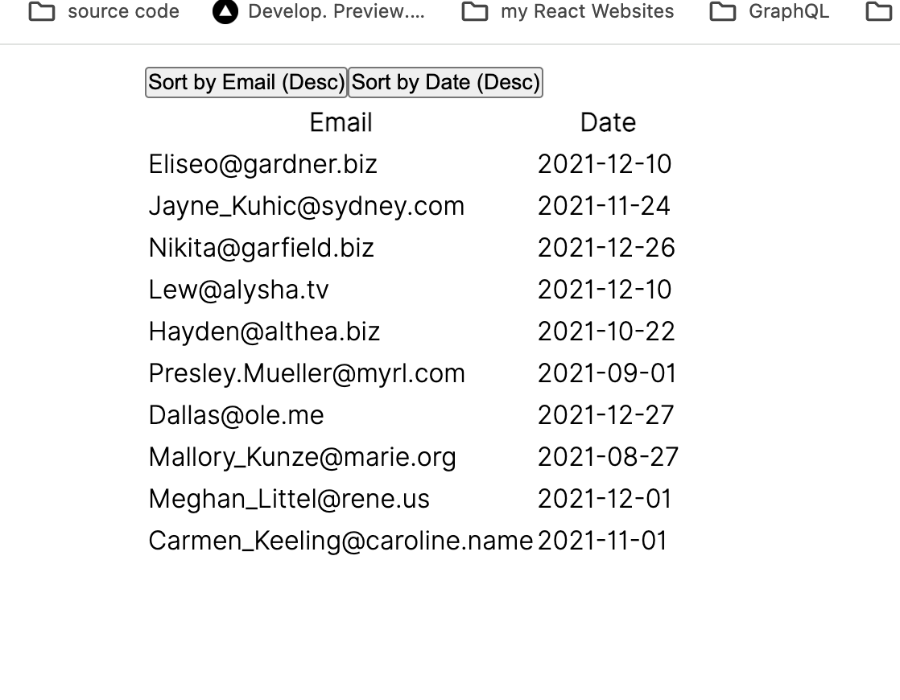

# ShopStore

A React.js project test.


## Technologies Used

- **React.js**: A JavaScript library for building user interfaces.


## Getting Started

1. Clone the repository:

    ```bash
    git clone https://github.com/rezaansarirad/test.git
    ```

2. Install dependencies:

    ```bash
    npm install
    ```

3. Run the project:

    ```bash
    npm start
    ```

## Screenshots




<!-- Add more screenshots if needed -->

## Contributing

Feel free to contribute to the project by opening issues or creating pull requests. Your feedback and suggestions are highly appreciated.

Hope you enjoy.